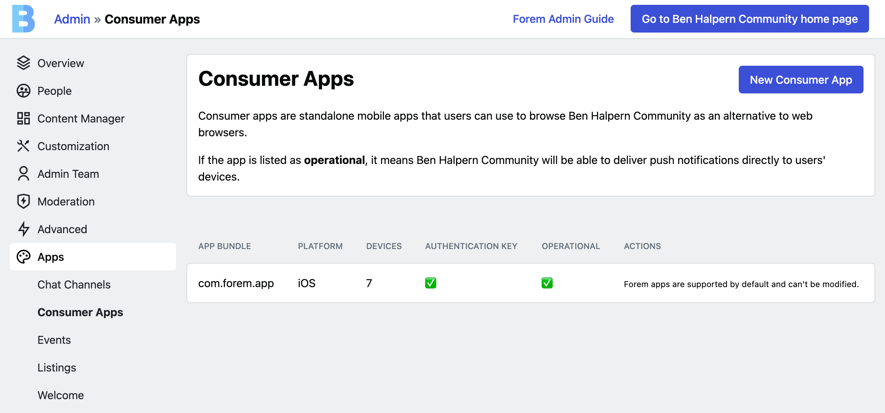

# Consumer Apps

The [Forem iOS app](https://apps.apple.com/us/app/forem/id1536933197) is the first official mobile app built to interact with multiple Forems and it is integrated by default, regardless if it's a selfhost or a Forem Cloud instance.

The architecture decisions we've made have had decentralization and extensibility in mind. Because of this, we added a section to the Admin dashboard where creators can add custom apps so their Forem web app is able to integrate with any 3rd party app, on top of the default official Forem apps.

### Push Notifications

Forem instances are able to deliver Push Notifications directly to any Consumer App that has been configured correctly. Creators get an overview of each Consumer App so they can tell how many Devices have been registered to receive Push Notifications and whether or not the Consumer App is operational. If the app isn't operational it means a problem has been identified and Push Notifications are likely not being delivered as expected.

### Universal Links \(iOS\)

Consumer Apps in the iOS platform will be presented with an extra \(optional\) field to configure: The Apple Membership Team ID.

Once you add this value to your Consumer App the Forem instance will automatically configure the server-side steps in order to have support for [Universal Links](https://developer.apple.com/library/archive/documentation/General/Conceptual/AppSearch/UniversalLinks.html), also known as the `apple-app-site-association`  file.

You can verify your custom Consumer App is configured to support Universal Links by visiting `https://your.domain/.well-known/apple-app-site-association`and making sure your App ID \(Team ID + App Bundle\) is included in the response

