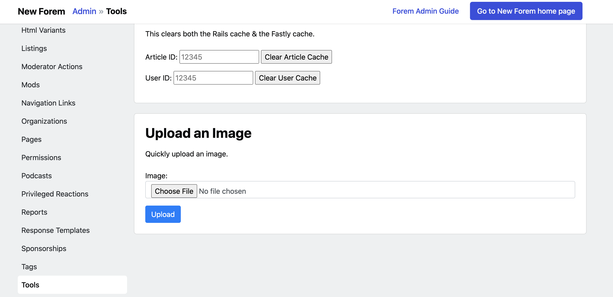

# FAQ

### How do I set the logo on my Forem?

Be sure to fill out all fields on the [Config &gt; Images](admin/config/all-site-configuration/images.md) page.  Due to caching, it may take a few minutes for your changes to appear.

### How do I change the background image of the onboarding screens?

Head over to [Config &gt; Onboarding](admin/config/all-site-configuration/onboarding.md) to change the background image.  This will add a nice spruce of personality as new members join your forem.

### How do I upload an image to get its direct image URL?

You can go to `/admin/tools` in your Forem Admin page to upload an image.

Your image URL will look something like this: `dev-to-uploads.s3.amazonaws.com/i/alk5808pwnt3j8sb8th3.png`

