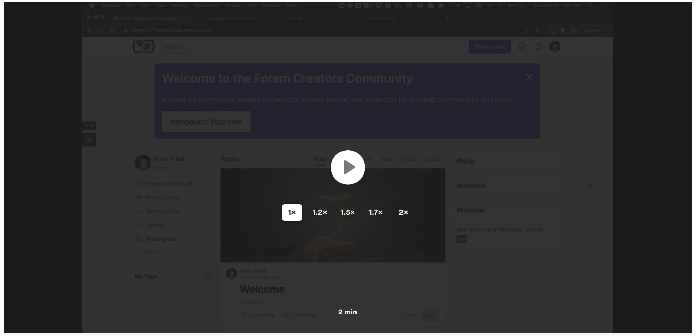

# Customizing with Campaigns + Display Ads

\*\*\*\*[**Here is a 2-minute video walkthrough on how to set up a Campaign Banner**](https://www.loom.com/share/55492537c0a24701a78ceb9271365c6b)**.**

**For more information, please refer to:**

* [Setting a campaign hero HTML](../admin/config/campaign.md#campaign-hero-html-variant-name)
* [Setting a campaign sidebar image](../admin/config/campaign.md#campaign-sidebar-image)
* [Setting a display ad](../admin/display-ads.md)

